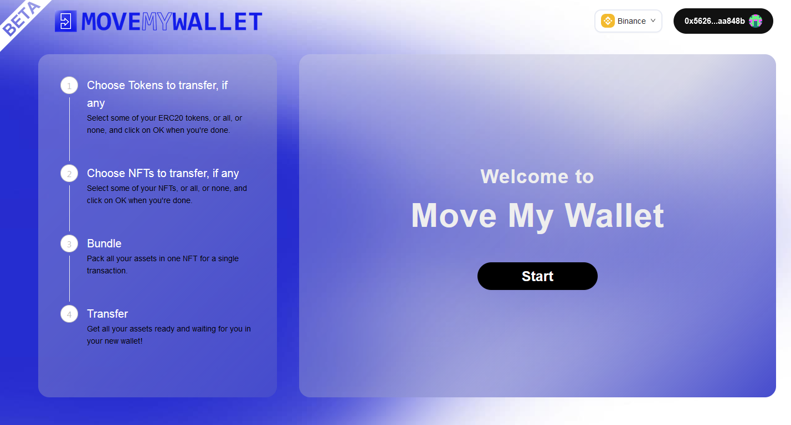

# Move My Wallet - Transfer all the assets from one wallet to another easily.

[](https://github.com/shamrockstudios/MoveMyWallet-app/stargazers)
[](https://github.com/shamrockstudios/MoveMyWallet-app/issues)
[](https://github.com/shamrockstudios/MoveMyWallet-app/blob/main/License)

## Description

Cross-chain Dapp deployed on Ethereum, Binance Smart-Chain and Polygon. Allow any user to quickly and simply transfer all assets (ERC20, ERC721 and ERC1155) from one address to another.

- Website: https://www.movemywallet.com/
- Dapp: https://app.movemywallet.com/
  <br></br>



## Installation

💿 Clone the repo and install all dependencies:

```sh
git clone https://github.com/shamrockstudios/MoveMyWallet-app
cd MoveMyWallet-App
yarn install
```

✏ Create a `.env` file in the main folder and provide your `appId` and `serverUrl` from Moralis ([How to start Moralis Server](https://docs.moralis.io/moralis-server/getting-started/create-a-moralis-server))
Example:

```jsx
REACT_APP_MORALIS_APPLICATION_ID = xxxxxxxxxxxx
REACT_APP_MORALIS_SERVER_URL = https://xxxxxx.grandmoralis.com:2053/server
```

🔎 Locate the file constant.js in `src/helpers/constant.js` and paste your smart-contracts addresses and ABI;

```jsx
const ASSEMBLY_NFT = "your Contract Address here";
const ABI = "your Contract ABI here";
```

🚴‍♂️ Run your App:

```sh
yarn start
```
