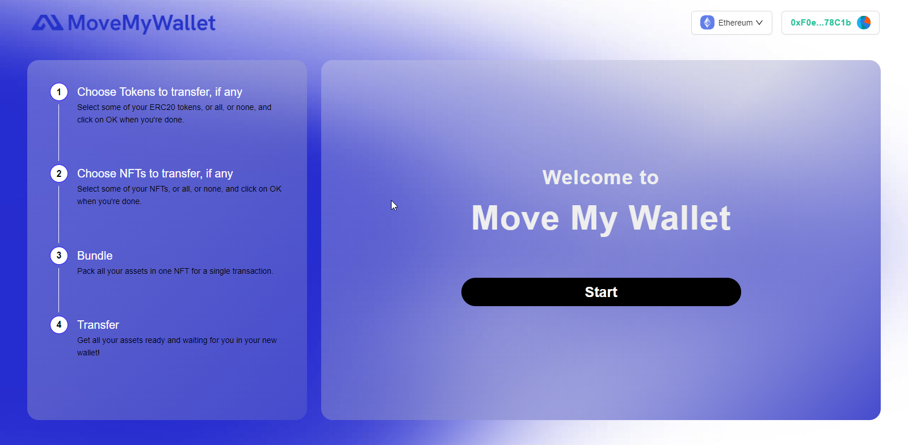

<div align="center">

<br><br>
<h1><strong>Transfer all the assets from one wallet to another easily.</strong></h1>

[](https://github.com/shamrockstudios/MoveMyWallet-app/stargazers)
[](https://github.com/shamrockstudios/MoveMyWallet-app/issues)
[](https://github.com/shamrockstudios/MoveMyWallet-app/blob/main/License)

</div>

## Description

Cross-chain Dapp deployed on Ethereum, Binance Smart-Chain and Polygon. Allow any user to quickly and simply transfer all assets (ERC20, ERC721 and ERC1155) from one address to another.

-   Website: https://www.movemywallet.com/
-   Dapp: https://app.movemywallet.com/
    <br></br>



## Front-end Installation

💿 Clone the repo and install all dependencies:

```sh
git clone https://github.com/superultra-io/MoveMyWallet-app.git
cd MoveMyWallet-App
yarn install
```

✏ Edit the `.env.example` file in the main folder with all required info. Don't forget to remove `.example` !
Example:

```jsx
NEXT_PUBLIC_NODE_ENV = development;
NEXT_PUBLIC_ALCHEMY_API_KEY = api_key_here;
NEXT_PUBLIC_WALLETCONNECT_PROJECT_ID = api_key_here;

MORALIS_API_KEY = api_key_here;
ALCHEMY_API_KEY = api_key_here;
MONGODB_URI = uri_here;
MONGODB_COLLECTION = collection_name;
```

🔎 Locate the file constant.js in `src/data/constant.ts` and paste your smart-contracts addresses;

```jsx
// Production:
export const MOVE_MY_WALLET_ETHEREUM = "";
export const MOVE_MY_WALLET_BSC = "";
export const MOVE_MY_WALLET_POLYGON = "";

// Development:
export const MOVE_MY_WALLET_GOERLI = "";
export const MOVE_MY_WALLET_MUMBAI = "";
export const MOVE_MY_WALLET_BSC_TESTNET = "";
```

🔎 Locate the ABIs files in the `src/data/abis` folder and edit your ABIs if you've made any changes to the smart-contracts;

```jsx
export const NFT_ABI = ["NFT ABI here...];
```

🚴‍♂️ Run your App:

Dev. mode:

```sh
yarn dev
```

Prod. mode:

```sh
yarn start
```

## Smart-contract deployment

💿 Move inside the `hardhat` folder and install all dependencies:

```sh
cd hardhat
yarn install
```

✏ Edit the `.env.example` file in the main folder with all required info. Don't forget to remove `.example` !

✏ Edit the hardhat.config.ts as needed, if needed, then make sure to select the correct network in the package.json `script` section.

```json
"scripts": {
        ...
        "deploy": "hardhat run --network ethereum scripts/deploy.ts",
        ...
    },
```

💿 Test that everything is working as intended:

```sh
yarn test
```

💿 Deploy your contracts:

```sh
yarn deploy
```

<div align="center">
<h2>Enjoy!!!</h2>

### ⭐️ ... and don't forget to leave a star if you like it! ⭐️

</div>

<p align="right">(<a href="#top">back to top</a>)</p>
